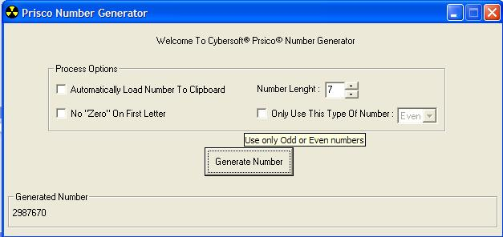



## A cool Random Number Generator

### Description

This app generates random numbers up to 100 letters...and you can control type of number

(Odd or Even)..and can automatically copy the generated number into the system clipboard...and etc;
 
### More Info
 
Number lenght..and some parameters

generated number

             |
---                |---
**Submitted On**   |2002-08-01 23:33:08
**By**             |[Arash Yadegarnia](https://github.com/Planet-Source-Code/PSCIndex/blob/master/ByAuthor/arash-yadegarnia.md)
**Level**          |Beginner
**User Rating**    |3.7 (11 globes from 3 users)
**Compatibility**  |VB 4\.0 \(16\-bit\), VB 4\.0 \(32\-bit\), VB 5\.0, VB 6\.0
**Category**       |[Complete Applications](https://github.com/Planet-Source-Code/PSCIndex/blob/master/ByCategory/complete-applications__1-27.md)
**World**          |[Visual Basic](https://github.com/Planet-Source-Code/PSCIndex/blob/master/ByWorld/visual-basic.md)
**Archive File**   |[A\_cool\_Ran113318812002\.zip](https://github.com/Planet-Source-Code/arash-yadegarnia-a-cool-random-number-generator__1-37510/archive/master.zip)

